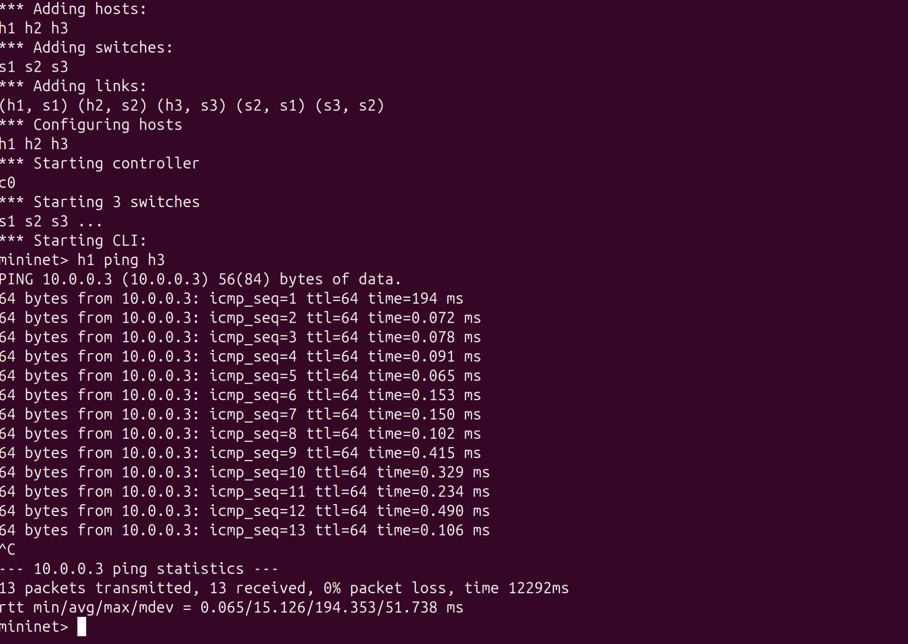
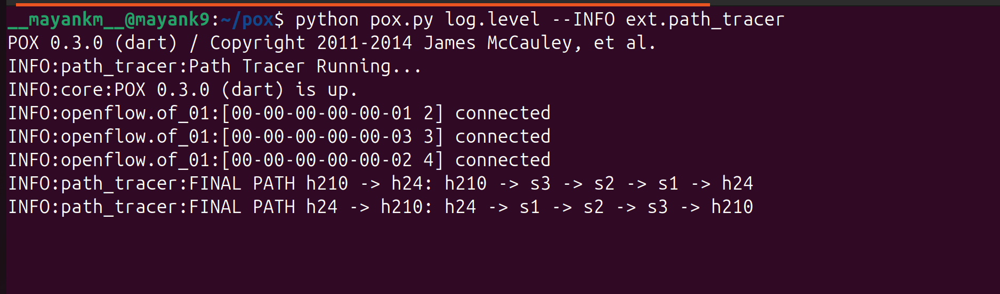

# Path Tracing Tool (SDN - POX)

## Description
This project tracks and displays the path taken by packets in an SDN network using the POX controller and Mininet.

## How to Run

### Start POX
```
cd ~/pox
python pox.py log.level --INFO ext.path_tracer
```

### Start Mininet
```
sudo mn -c
sudo mn --topo linear,3 --controller=remote
```

### Test
```
h1 ping h3
```

## Output

### Mininet


### POX Controller


## Result
The controller prints the full path:
```
FINAL PATH h1 -> h3: h1 -> s1 -> s2 -> s3 -> h3
```
